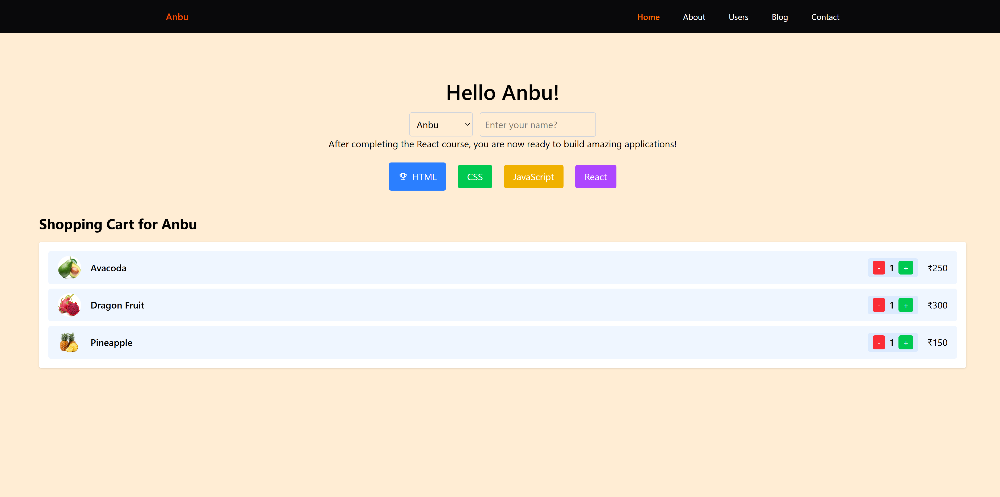

# Teaching React - Learning Journey

A practical React learning project built with **Vite** and **JSX**, documenting daily learning concepts and implementation examples.



---

## 📚 Learning Path Overview

- [Day 1: DOM, React.createElement & JSX Foundation](#day-1)
- [Day 2: React Components, Folder Structure & Props](#day-2)
- [Day 3: React State & useState Hook](#day-3)
- [Day 4: React Lifecycle, useEffect, Conditional Rendering & Fetch API](#day-4)
- [Day 5: Forms, Controlled Inputs, Validation & Submitting to API](#day-5)
- [Day 6: React Router — Declarative Client-Side Routing](#day-6)
- [Day 7: Context API & API Fetch Design](#day-7)
- [Day 8: React.memo, useCallback, and useMemo](#day-8)

---

## 📚 Learning Path Overview

This project tracks the step-by-step learning of React fundamentals, from DOM manipulation to component-based architecture.

---

<a id="day-1"></a>

## 🗓️ Day 1: DOM, React.createElement & JSX Foundation

**Date:** February 17, 2026

### Concepts Covered

- **JavaScript DOM**: Understanding the Document Object Model and DOM manipulation
- **React.createElement**: Creating React elements programmatically without JSX
- **Vite + React Setup**: Project initialization with Vite and JSX support
- **JSX Syntax**: Writing React components using JSX syntax

### Key Learnings

#### What is DOM?

The DOM (Document Object Model) is a programming interface for HTML and XML documents. It represents the structure of the document as a tree of objects that can be manipulated with JavaScript.

```javascript
// Traditional DOM manipulation
const element = document.createElement("div");
element.textContent = "Hello World";
document.body.appendChild(element);
```

#### React.createElement

React allows you to create elements using `React.createElement()` as an alternative to JSX:

```javascript
import React from "react";

// Without JSX
const element = React.createElement(
  "h1",
  { className: "title" },
  "Hello React",
);

// With JSX (compiles to React.createElement)
const element = <h1 className="title">Hello React</h1>;
```

#### Project Setup with Vite

This project was initialized using Vite's React template, which provides:

- Fast refresh (HMR)
- ESLint configuration
- Optimized build process

### Code References

- **Check this repo**: [https://github.com/anburocky3/dom-vs-virtual-dom](https://github.com/anburocky3/dom-vs-virtual-dom)

---

<a id="day-2"></a>

## 🗓️ Day 2: React Components, Folder Structure & Props

**Date:** February 18, 2026

### Concepts Covered

- **React Folder Structure**: Organizing React projects for scalability
- **React Components**: Breaking UI into reusable functional components
- **Props**: Passing data from parent to child components
- **Object Destructuring**: Extracting props cleanly in component parameters

### Key Learnings

#### Project Folder Structure

```
src/
├── App.jsx                 # Root component
├── main.jsx                # Entry point
├── index.css               # Global styles
└── components/             # Reusable components
    ├── Header.jsx
    ├── Footer.jsx
    ├── BadgeItem.jsx
    └── ...
```

**Best Practice**: Organize components in a dedicated `components/` folder to maintain scalability and separation of concerns.

#### React Components

Components are the building blocks of React applications. They return JSX and can be functional or class-based. Modern React uses **functional components**.

```javascript
// Functional Component
function Header() {
  return <header className="header">React App</header>;
}

export default Header;
```

#### Props (Properties)

Props allow you to pass data from parent to child components. They are read-only and enable component reusability.

```javascript
// Parent Component
<BadgeItem id={1} title="React" level="Beginner" />;

// Child Component - Without Destructuring
function BadgeItem(props) {
  return (
    <div>
      {props.title} - {props.level}
    </div>
  );
}

// Child Component - With Object Destructuring (Recommended)
function BadgeItem({ id, title, level }) {
  return (
    <div>
      <span>{id}</span>
      <h3>{title}</h3>
      <p>Level: {level}</p>
    </div>
  );
}
```

#### Why Object Destructuring?

- **Cleaner Code**: No need to prefix with `props.`
- **Better Readability**: Clear which props the component uses
- **Easier Maintenance**: Easy to see all expected props at a glance

### Code References

#### Component Files

- **Header Component**: [src/components/Header.jsx](src/components/Header.jsx) - Top navigation component
- **Footer Component**: [src/components/Footer.jsx](src/components/Footer.jsx) - Bottom section component
- **BadgeItem Component**: [src/components/BadgeItem.jsx](src/components/BadgeItem.jsx) - Reusable badge component demonstrating props with destructuring
- **App Component**: [src/App.jsx](src/App.jsx) - Main app component showing component composition and props passing

#### Key Implementation Example

The [BadgeItem.jsx](src/components/BadgeItem.jsx) component demonstrates:

- Receiving props with object destructuring
- Rendering data based on props
- Reusability across multiple instances

---

<a id="day-3"></a>

## �️ Day 3: React State & useState Hook

**Date:** February 19, 2026  
**Commits:** 4 commits

### Concepts Covered

- **React State**: Understanding component state and why it's essential
- **useState Hook**: Managing state in functional components
- **State vs Props**: Key differences and when to use each
- **Re-rendering**: How state changes trigger component re-renders
- **Practical Examples**: Real-world state management scenarios

### Key Learnings

#### What is React State?

State is a JavaScript object that holds data that may change over the lifetime of a component. When state changes, React automatically re-renders the component to reflect the new data in the UI.

```javascript
import { useState } from "react";

function Counter() {
  // Declare a state variable 'count' with initial value 0
  const [count, setCount] = useState(0);

  return (
    <div>
      <p>Count: {count}</p>
      <button onClick={() => setCount(count + 1)}>Increment</button>
    </div>
  );
}
```

#### Why Use React State?

1. **Reactivity**: State changes automatically trigger UI updates
2. **Component Memory**: Preserve data across re-renders
3. **User Interaction**: Track and respond to user actions
4. **Dynamic UIs**: Create interactive, responsive applications
5. **Data Persistence**: Maintain component-specific data

**Without State (Problem):**

```javascript
// ❌ This won't work - component won't re-render
let count = 0;

function BadCounter() {
  count++; // Changes won't reflect in UI
  return <p>Count: {count}</p>;
}
```

**With State (Solution):**

```javascript
// ✅ This works - triggers re-render on state change
function GoodCounter() {
  const [count, setCount] = useState(0);

  const increment = () => setCount(count + 1);

  return <p>Count: {count}</p>;
}
```

#### useState Hook Syntax

```javascript
const [stateVariable, setStateFunction] = useState(initialValue);
```

- **stateVariable**: Current state value
- **setStateFunction**: Function to update the state
- **initialValue**: Initial state value (any data type)

#### State vs Props

| Feature      | State                    | Props                        |
| ------------ | ------------------------ | ---------------------------- |
| **Mutable**  | Yes (via setState)       | No (read-only)               |
| **Owned by** | Component itself         | Parent component             |
| **Purpose**  | Internal data management | Pass data between components |
| **Changes**  | Triggers re-render       | Received from parent         |

#### Practical Examples

**Example 1: Toggle Visibility**

```javascript
function ToggleContent() {
  const [isVisible, setIsVisible] = useState(false);

  return (
    <div>
      <button onClick={() => setIsVisible(!isVisible)}>
        {isVisible ? "Hide" : "Show"}
      </button>
      {isVisible && <p>This content can be toggled!</p>}
    </div>
  );
}
```

**Example 2: Form Input**

```javascript
function InputForm() {
  const [text, setText] = useState("");

  return (
    <div>
      <input value={text} onChange={(e) => setText(e.target.value)} />
      <p>You typed: {text}</p>
    </div>
  );
}
```

**Example 3: Shopping Cart**

```javascript
function ShoppingCart() {
  const [items, setItems] = useState([]);

  const addItem = (item) => setItems([...items, item]);
  const removeItem = (index) => setItems(items.filter((_, i) => i !== index));

  return (
    <div>
      <p>Cart Items: {items.length}</p>
      {/* Cart UI */}
    </div>
  );
}
```

### Best Practices

- **Don't Mutate State Directly**: Always use the setter function
- **State is Asynchronous**: Don't rely on state value immediately after setting
- **Initialize Properly**: Provide appropriate initial values
- **Keep State Minimal**: Only store what's necessary
- **Lift State Up**: Share state by moving it to common parent component

---

<a id="day-4"></a>

## 🗓️ Day 4: React Lifecycle, useEffect, Conditional Rendering & Fetch API

**Date:** February 23, 2026

### Concepts Covered

- **React Lifecycle with Hooks**: Understanding mount, update, and unmount phases using `useEffect`
- **useEffect Dependency Array**: Controlling when side effects run
- **Cleanup Functions**: Removing side effects (e.g., intervals/event listeners) during unmount or re-run
- **Conditional Rendering**: Displaying UI based on runtime conditions
- **Async/Await + Fetch**: Fetching API records with practical search and limit filters

### Key Learnings

#### React Lifecycle with `useEffect`

In functional components, `useEffect` helps model lifecycle behavior:

- **Mount (Birth)**: Effect runs after first render
- **Update (Live)**: Effect re-runs when dependencies change
- **Unmount (Death)**: Cleanup runs before component is removed

```javascript
useEffect(() => {
  console.log("Component mounted");

  const intervalId = setInterval(() => {
    console.log("Running side effect...");
  }, 1000);

  return () => {
    clearInterval(intervalId);
    console.log("Component unmounted");
  };
}, []);
```

#### Dependency Array Behavior

- `[]` → Runs once on mount, cleanup on unmount
- `[count]` → Runs on mount and whenever `count` changes
- No dependency array → Runs after every render

#### Conditional Rendering Patterns

Used multiple practical conditional rendering styles:

```javascript
{
  users.length === 0 ? <p>No users found.</p> : null;
}

{
  users.length > 0 && (
    <ul>
      {users.map((user) => (
        <li key={user.id}>{user.name}</li>
      ))}
    </ul>
  );
}
```

- **Ternary** for true/false style rendering
- **Logical AND (`&&`)** for render-if-true blocks

#### Fetching API Data with Async/Await

Practical API integration using `fetch` + `await`:

```javascript
useEffect(() => {
  async function fetchUsers() {
    const response = await fetch(
      `https://mimic-server-api.vercel.app/users?_limit=${limit}&q=${searchTerm}`,
    );
    const data = await response.json();
    setUsers(data);
  }

  fetchUsers();
}, [searchTerm, limit]);
```

This demonstrates:

- Fetching records on first render
- Re-fetching when search input changes
- Re-fetching when page size/limit changes
- Updating state to re-render the UI with latest data

### Code References

- **Main App Integration**: [src/App.jsx](src/App.jsx)
- **API Fetch + Conditional Rendering**: [src/components/api/RenderUsers.jsx](src/components/api/RenderUsers.jsx)
- **Lifecycle Notes & Demo Snippets**: [LEARNING.md](LEARNING.md)

---

<a id="day-5"></a>

## 🗓️ Day 5: Forms, Controlled Inputs, Validation & Submitting to API

**Date:** February 25, 2026

### Concepts Covered

- **Single controlled input**: managing a single piece of state for one field
- **Multiple inputs (best practice)**: using a single state object and a generic `onChange` handler
- **Reusable form field components**: split fields into `Input`, `InputLabel`, and `InputGroup` for consistency
- **Client-side validation**: simple required/length checks and basic email validation before submit
- **Submitting data to API**: POSTing validated form data to the mimic API

### Key Learnings & Examples

#### Reusable Form Components

Each field is a small component for clarity and reuse:

- [src/components/ui/forms/Input.jsx](src/components/ui/forms/Input.jsx)
- [src/components/ui/forms/InputLabel.jsx](src/components/ui/forms/InputLabel.jsx)
- [src/components/ui/forms/InputGroup.jsx](src/components/ui/forms/InputGroup.jsx)

These wrap native inputs and labels so form markup is consistent across the app.

#### Single Input (Controlled)

```javascript
const [name, setName] = useState("");

<Input
  name="name"
  value={name}
  onChange={(e) => setName(e.target.value)}
  placeholder="Your name"
/>;
```

This pattern keeps the input value in React state so the UI always reflects the source of truth.

#### Multiple Inputs (Best Practice)

Use one state object and a generic handler:

```javascript
const [form, setForm] = useState({ name: "", email: "" });

function handleChange(e) {
  const { name, value } = e.target;
  setForm((prev) => ({ ...prev, [name]: value }));
}

<Input name="name" value={form.name} onChange={handleChange} />
<Input name="email" value={form.email} onChange={handleChange} />
```

This scales well when adding fields and lets you keep the submit handler simple.

#### Validation Example

```javascript
function validate(form) {
  if (!form.name || form.name.length < 3)
    return "Name must be at least 3 characters";
  if (!/^[^@\s]+@[^@\s]+\.[^@\s]+$/.test(form.email)) return "Invalid email";
  return null;
}
```

#### Submitting to the Mimic API

```javascript
async function handleSubmit(e) {
  e.preventDefault();

  const error = validate(form);
  if (error) {
    // show error to user
    return;
  }

  const response = await fetch("https://mimic-server-api.vercel.app/users", {
    method: "POST",
    headers: { "Content-Type": "application/json" },
    body: JSON.stringify(form),
  });

  const data = await response.json();
  // handle success (reset form, show message, etc.)
}
```

Notes:

- The project used the mimic-server-api (https://github.com/anburocky3/mimic-server-api/fork) for the demo backend.
- Always validate before sending and show clear feedback to learners.

---

<a id="day-6"></a>

## 🗓️ Day 6: React Router — Declarative Client-Side Routing

**Date:** March 2, 2026

### Concepts Covered

- **Declarative Routing**: Using `<BrowserRouter>`, `<Routes>`, and `<Route>` components instead of imperative code
- **Route Matching**: Path parameters, nested routes, and wildcard patterns
- **Navigation**: `<Link>` and `<NavLink>` for client-side navigation without full page reload
- **Dynamic Routes**: Extracting URL parameters with `useParams()`
- **Nested Components**: Organizing routes with `<Outlet>` for shared layouts

### Key Learnings

#### Setup & Provider Pattern

```javascript
import { BrowserRouter, Routes, Route } from "react-router-dom";

function App() {
  return (
    <BrowserRouter>
      <Routes>
        <Route path="/" element={<Home />} />
        <Route path="/users" element={<Users />} />
        <Route path="/users/:id" element={<UserDetail />} />
      </Routes>
    </BrowserRouter>
  );
}
```

Declarative routing keeps the router structure visible at the top level.

#### Navigation with Link

```javascript
import { Link } from "react-router-dom";

function Navigation() {
  return (
    <nav>
      <Link to="/">Home</Link>
      <Link to="/users">Users</Link>
    </nav>
  );
}
```

`<Link>` prevents full page reload and updates URL without network request.

#### Dynamic Route Parameters

```javascript
import { useParams } from "react-router-dom";

function UserDetail() {
  const { id } = useParams();

  useEffect(() => {
    // Fetch user by id
    fetch(`https://mimic-server-api.vercel.app/users/${id}`)
      .then((res) => res.json())
      .then((user) => setUser(user));
  }, [id]);

  return <div>User ID: {id}</div>;
}
```

#### Nested Routes & Layout Sharing

```javascript
<Routes>
  <Route element={<Layout />}>
    <Route path="/" element={<Home />} />
    <Route path="/users" element={<Users />} />
    <Route path="*" element={<NotFound />} />
  </Route>
</Routes>
```

Use `<Outlet>` in `Layout` to render child routes.

### Best Practices

- Wrap app with `<BrowserRouter>` at the top level (usually in `main.jsx`)
- Use `<NavLink>` for navigation items to highlight active routes
- Always fetch dependent data in `useEffect` with `useParams()` values in dependency array
- Handle 404s with a catch-all route (`path="*"`)

### Resources

- Official Docs: [reactrouter.com](https://reactrouter.com)
- Declarative vs Imperative: Demonstrate why component-based routing is clearer and more React-like

---

<a id="day-7"></a>

## 🗓️ Day 7: Context API & API Fetch Design

**Date:** March 3, 2026

### Concepts Covered

- **API integration UX**: designing user interfaces around data fetched from `mimic-server-api` endpoints
- **Context API (React 19.2)**: creating providers, wrapping the app, and consuming context in child components
- **Shared state using Context**: avoiding prop drilling for global data such as fetched records, theme, or auth info
- **Challenges for practice**: build a context-based data provider and create multiple consumer components that react to it

### Key Learnings

#### Fetching & UI/UX

Learners experimented with several endpoints from the mimic API and focused on presenting results with clean UI:

- Design a loader/spinner while data is being fetched
- Show error messages when fetch fails
- Build search/filter controls that update context state and trigger new requests

#### Context API Basics

```javascript
const UserContext = React.createContext();

function UserProvider({ children }) {
  const [users, setUsers] = useState([]);

  useEffect(() => {
    fetch("https://mimic-server-api.vercel.app/users")
      .then((r) => r.json())
      .then(setUsers);
  }, []);

  return (
    <UserContext.Provider value={{ users, setUsers }}>
      {children}
    </UserContext.Provider>
  );
}

function UserList() {
  const { users } = useContext(UserContext);
  return (
    <ul>
      {users.map((u) => (
        <li key={u.id}>{u.name}</li>
      ))}
    </ul>
  );
}
```

Wrap the root (often in `main.jsx`) with `<UserProvider>` so any component can call `useContext(UserContext)`.

#### Challenges

1. Create a `ThemeContext` that toggles between light/dark modes and use it in multiple components.
2. Build a search form that updates context state and displays filtered results in another component.
3. Implement a paginator with context-managed page number and fetch new data accordingly.

---

<a id="day-8"></a>

## Day 8: React.memo, useCallback, and useMemo

**Date:** March 9, 2026
**Based on last 3 commits:**

- `D8: memo functions in react`
- `D8: useCallback with memo functions`
- `D8: useMemo`

### Concepts Covered

- **`React.memo`**: Skip child re-rendering when props have not changed
- **`useCallback`**: Keep callback reference stable between parent renders
- **`useMemo`**: Cache computed values and recompute only when dependencies change
- **Render behavior**: Understand why parent re-renders first when parent state changes

### Key Learnings

#### 1. Parent Re-renders First (Expected)

In the memo experiment page, `parent`, `child1`, and `child2` are all state values in the same parent component (`MemoHookPage`).
So updating any of these values triggers a parent render first.

#### 2. `React.memo` for Child Components

`ChildPage1` and `ChildPage2` are wrapped with `memo(...)`:

```javascript
import { memo } from "react";

const ChildPage1 = memo(({ value, updateChild }) => {
  return <h3>Child Page 1 - {value}</h3>;
});
```

This helps avoid re-rendering a child when both `value` and `updateChild` props are unchanged.

#### 3. `useCallback` with Memoized Children

When passing functions as props, callback identity matters. `useCallback` keeps the same function reference across renders:

```javascript
const updateChild1 = useCallback(() => {
  setChild1(Math.floor(Math.random() * 100));
}, []);

const updateChild2 = useCallback(() => {
  setChild2(Math.floor(Math.random() * 100));
}, []);
```

Without `useCallback`, a new function is created on each parent render, which can cause memoized children to re-render unnecessarily.

#### 4. `useMemo` for Derived/Computed Values

The `ReactUseMemoPage` demonstrates memoizing a salary calculation:

```javascript
const grossSalary = useMemo(() => {
  return (
    user.baseSalary +
    user.bonus +
    user.homeAllowance +
    user.fuelAllowance -
    user.tax
  );
}, [user]);
```

Use this pattern for expensive computations or derived values that should not recompute on every render.

### Code References

- `src/pages/experiments/MemoHookPage.jsx` - parent/child render behavior + `useCallback`
- `src/pages/experiments/ChildPage1.jsx` - `React.memo` child example
- `src/pages/experiments/ChildPage2.jsx` - `React.memo` child example
- `src/pages/experiments/ReactUseMemoPage.jsx` - `useMemo` computation example
- `src/pages/experiments/ExperimentIndexPage.jsx` - navigation links for experiments

### Practical Notes

- Use `React.memo` when child props are stable and rendering is non-trivial.
- Use `useCallback` primarily when passing handlers to memoized children.
- Use `useMemo` for expensive derived values, not for every small expression.
- Optimization hooks should be measured with React DevTools profiler before overusing them.

---

## �🔧 Setup & Running the Project

### Prerequisites

- Node.js (v16 or higher)
- npm or yarn

### Installation

```bash
npm install
```

### Development Server

```bash
npm run dev
```

### Build for Production

```bash
npm run build
```

---

## 📖 Resources

- [React Official Documentation](https://react.dev)
- [Vite Documentation](https://vite.dev)
- [MDN Web Docs - DOM](https://developer.mozilla.org/en-US/docs/Web/API/Document_Object_Model)

---

## 📝 Next Steps

- **Day 9**: Implement `useReducer` experiments and compare with `useState` for complex state transitions
- Add route-level examples for both `React.memo + useCallback` and `useMemo` under `/experiments`
- Add profiler screenshots to document render optimizations visually

---

**Last Updated**: March 9, 2026
